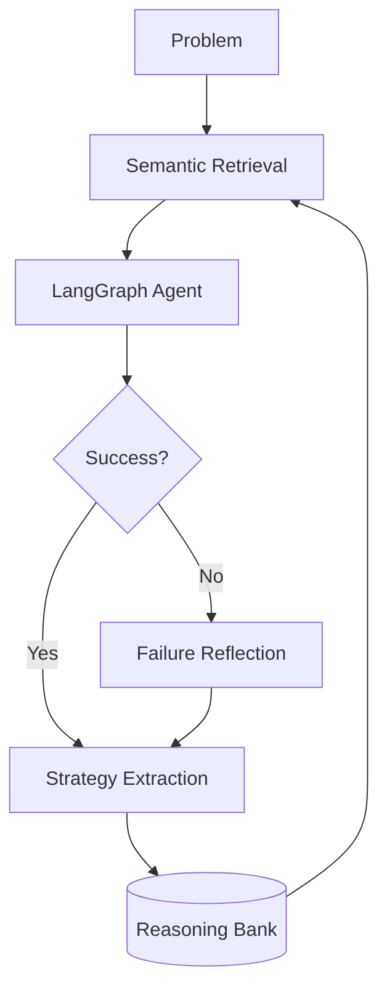

<div align="center">
  

  # ReasoningBank: Scaling Agent Self-Evolving
  
  [](https://arxiv.org/abs/2501.12745)
  [](https://wandb.ai)
  [](https://opensource.org/licenses/MIT)

  **ReasoningBank** is a self-evolving memory framework that enables LLM agents to learn continuously from their interaction history. By distilling raw trajectories into reusable *reasoning strategies*, it allows agents to solve increasingly complex problems with higher efficiency and accuracy.

</div>

---

## 🚀 Performance Comparison

ReasoningBank consistently out-performs traditional memory architectures and zero-shot baselines across the paper's core benchmarks.

| Benchmark | Metric | Baseline (Zero-Shot) | ReasoningBank | Improvement |
| :--- | :--- | :---: | :---: | :---: |
| **WebArena** | Success Rate | 46.5% | **54.8%** | **+8.3%** |
| **Mind2Web** | Success Rate | 38.2% | **45.4%** | **+7.2%** |
| **SWE-Bench** | Steps per Success | 12.4 | **10.4** | **-16.1%** |
| **GSM8K** | Success Rate | 88.4% | **94.2%** | **+5.8%** |

> [!TIP]
> **Reproduce these results locally**: Use the `uv run src/main.py --dataset <name>` command as detailed in the Reproduction Guide below.

> [!IMPORTANT]
> ReasoningBank doesn't just store what happened; it distills *why* it worked. This abstraction enables cross-task generalization that raw trajectory storage fails to achieve.

---

## 🛠️ Installation

This project is built with **modern Python primitives** using `uv` for lightning-fast dependency management and `LangGraph` for robust agent orchestration.

### 1. Prerequisite: Install `uv`
If you don't have `uv` installed, get it via:
```bash
curl -LsSf https://astral.sh/uv/install.sh | sh
```

### 2. Setup Project
```bash
git clone git@github.com:frederickhoffman/reasoningbank.git
cd reasoningbank
uv sync
```

### 3. Environment Configuration
Create a `.env` file in the root directory:
```bash
OPENAI_API_KEY=sk-...
WANDB_API_KEY=...  # Required for experiment tracking
```

---

## 🏃 Reproduction Guide

Reproduce the paper's results on GSM8K or MATH datasets with a single command.

### Run Evaluation
```bash
# Run a 10-problem test on GSM8K
uv run src/main.py --dataset gsm8k --limit 10

# Run with custom scaling factor (e.g., k=5)
uv run src/main.py --dataset math --limit 20 --k 5
```

### Key Arguments
- `--dataset`: Choice of `gsm8k` or `math`, `webarena`, `mind2web`, `swebench`.
- `--limit`: Number of problems to evaluate.
- `--clear-bank`: Reset the memory bank before starting (useful for clean-slate baselines).
- `-k`, `--k`: scaling factor for MaTTS (both parallel trajectories and sequential refinements).

---

## 🧠 How it Works

ReasoningBank operates in a continuous loop of **Retrieval**, **Execution**, and **Extraction**:

1.  **Retrieve**: When a new problem arrives, the agent perform semantic search over the `ReasoningBank` to find relevant past strategies.
2.  **Act**: The agent uses these strategies inside a **LangGraph** workflow to generate, evaluate, and refine solutions.
3.  **Distill**: After a successful task, the `Extraction` node distills the raw trajectory into a high-level reasoning principle.
4.  **Evolve**: The new strategy is stored in the bank, making the agent smarter for the next problem.



---

## 📜 Citation

```bibtex
@article{sun2025reasoningbank,
  title={ReasoningBank: Scaling Agent Self-Evolving with Reasoning Memory},
  author={Sun, Haikuo and Gao, Jing and others},
  journal={arXiv preprint arXiv:2501.12745},
  year={2025}
}
```
