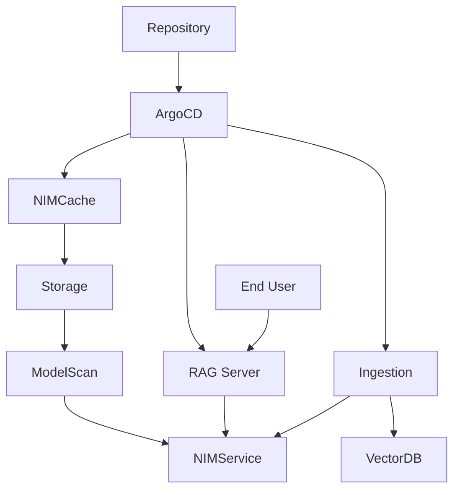

# 🦅 RAG-NIM: Secure GitOps for NVIDIA RAG on OpenShift

This repository provides a production-ready implementation of a Retrieval-Augmented Generation (RAG) system, automated via **GitOps** and secured with **proactive model scanning**. It is designed specifically for private **OpenShift** environments where data privacy and model integrity are paramount.

## 🏗️ System Design

The system orchestrates four key layers to provide a seamless RAG experience:

1.  **Orchestration (Argo CD)**: Automates the deployment and synchronization of the entire stack.
2.  **Inference (NVIDIA NIM Operator)**: Dynamically provisions and caches GPU-optimized AI models (LLMs, Embeddings, and Rerankers) directly within your OpenShift cluster.
3.  **Security (Protect AI ModelScan)**: A "security gate" that audits model weights for arbitrary code execution vulnerabilities before they are loaded.
4.  **Application (NVIDIA RAG Blueprint Server)**: A high-performance FastAPI server that manages document ingestion and retrieval pipelines.

---



### 🗝️ Key Components

1.  **NVIDIA NIM Operator**: Automates the lifecycle of AI models. It handles everything from downloading weights to optimized CUDA orchestration.
2.  **Argo CD**: Provides a declarative GitOps workflow. Your "Source of Truth" in Git is automatically reflected in your cluster.
3.  **Protect AI ModelScan**: A critical security layer that scans model weights for arbitrary code execution vulnerabilities *before* they are loaded into memory.
4.  **NVIDIA RAG Server**: A highly optimized FastAPI application that leverages LangChain and NVIDIA AI Endpoints for hybrid search and generation.

---

## 🌟 Features

*   **🔒 Air-Gapped Ready**: Designed to run entirely within your private network. No data leaves your cluster.
*   **🛡️ Secure-by-Design**: Integrated ModelScan ensures that external models don't introduce supply chain attacks.
*   **⚡ Optimized Performance**: Leverages TensorRT-LLM and CUDA via the NIM Operator for blazing-fast inference.
*   **🤖 Universal Model Support**: Easily swap between Llama-3, Nemotron, Mistral, and more using simple Helm overrides.

---

## 🛠️ Setup & Deployment

### 1. Prerequisites
*   **OpenShift cluster** (v1.23+) or **OpenShift Cluster** (v4.12+).
*   **NVIDIA GPUs** with the **NVIDIA GPU Operator** installed.
*   **NVIDIA NIM Operator** installed for automated model management.
*   **Argo CD** (optional) for GitOps-based deployment.

### 2. Configuration & Secrets

#### 🔑 NVIDIA NGC Setup
The NIM Operator requires credentials to download protected models from NVIDIA NGC.

1.  **Generate API Key**: Log in to [NGC](https://ngc.nvidia.com) > Setup > API Key.
2.  **Create Image Pull Secret**:
    ```bash
    oc create secret docker-registry ngc-secret \
      --docker-server=nvcr.io \
      --docker-username="\$oauthtoken" \
      --docker-password=<YOUR_NGC_API_KEY> \
      -n nvidia-rag
    ```
3.  **Create API Key Secret**:
    ```bash
    oc create secret opaque ngc-api \
      --from-literal=NGC_API_KEY=<YOUR_NGC_API_KEY> \
      -n nvidia-rag
    ```

#### 🛡️ OpenShift Security (SCC Binding)
If using **OpenShift**, you must bind the `nvidia-gpu-scc` to the application's service account to allow GPU access:

```bash
# Apply the declarative binding provided in this repo
oc apply -f deploy/openshift/scc-rolebinding.yaml
```

---

## 🚀 Deployment Options

### Option A: GitOps via Argo CD (Recommended)
This method automates the entire stack sync.
1.  Apply the application manifest:
    ```bash
    oc apply -f deploy/argocd/argocd-app.yaml
    ```
2.  In the Argo CD dashboard, locate `nvidia-rag-blueprint` and click **Sync**.

### Option B: Manual via Helm CLI
Use the environment-specific values files for a tailored deployment:

```bash
# For OpenShift with NIM Operator:
helm install rag-blueprint deploy/helm/nvidia-blueprint-rag \
  -f deploy/helm/nvidia-blueprint-rag/values.yaml \
  -f deploy/helm/values-nim-operator.yaml \
  -f deploy/helm/values-openshift.yaml
```

---

## 🤖 Self-Hosted NIM Configuration

When deploying with the **NVIDIA NIM Operator**, the system automatically creates `NIMCache` and `NIMService` resources. 

### Model Names
Ensure the model names in your overrides match your target hardware:
*   **LLM**: `nvidia/llama-3.3-nemotron-super-49b-v1.5`
*   **Embedding**: `nvidia/llama-3.2-nv-embedqa-1b-v2`
*   **Reranking**: `nvidia/llama-3.2-nv-rerankqa-1b-v2`

### Verification
Once deployed, verify that the RAG server can reach the internal NIM endpoints:
```bash
# Exec into a RAG server pod and test the NIM API
curl http://rag-server-nim-llm:8000/v1/models
```

---

## 🛡️ Security: ModelScan Integration

This blueprint includes an **ArgoCD Pre-Sync Security Hook**. Before any new model is synchronized, an audit Job runs **Protect AI ModelScan** to verify model weights for arbitrary code execution vulnerabilities.

---

## 📥 Document Ingestion Lifecycle

Ingestion converts raw files (PDFs, images) into searchable vector embeddings.

1.  **UI Upload**: Upload documents directly via the Chat UI.
2.  **Batch Ingestion**: Use the local [batch_ingestion.py](scripts/batch_ingestion.py) script to ingest large datasets from your local machine to the cluster.

---

## 💬 Interacting with the RAG System

1.  **Blueprint UI**: Responsive chat interface available at `http://<frontend-service-ip>:3000`.
2.  **API Documentation**:
    *   **RAG Server**: `http://<rag-server-ip>:8081/docs`
    *   **Ingestor**: `http://<ingestor-server-ip>:8082/docs`

---

## 🧪 Verification & Testing

Verify end-to-end functionality using the built-in smoke test:

```bash
# 1. Port-forward the services
oc port-forward svc/rag-server 8081:8081 -n nvidia-rag
oc port-forward svc/ingestor-server 8082:8082 -n nvidia-rag

# 2. Run the test
python tests/verify_deployment.py --rag-url http://localhost:8081 --ingest-url http://localhost:8082
```


