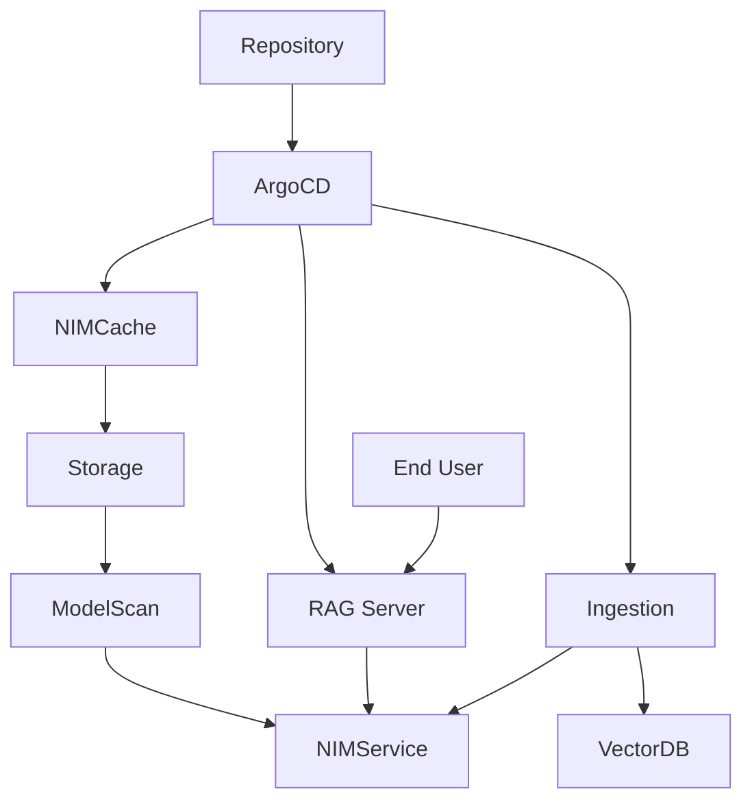

# 🦅 RAG-NIM: Secure GitOps for NVIDIA RAG

This repository provides a production-ready implementation of a Retrieval-Augmented Generation (RAG) system, automated via **GitOps** and secured with **proactive model scanning**. It is designed specifically for private Kubernetes and OpenShift environments where data privacy and model integrity are paramount.

## 🏗️ System Design

The system orchestrates four key layers to provide a seamless RAG experience:

1.  **Orchestration (Argo CD)**: Automates the deployment and synchronization of the entire stack.
2.  **Inference (NVIDIA NIM Operator)**: Dynamically provisions and caches GPU-optimized AI models (LLMs, Embeddings, and Rerankers) directly within your cluster.
3.  **Security (Protect AI ModelScan)**: A "security gate" that audits model weights for arbitrary code execution vulnerabilities before they are loaded.
4.  **Application (NVIDIA RAG Blueprint Server)**: A high-performance FastAPI server that manages document ingestion and retrieval pipelines.

---



### 🗝️ Key Components

1.  **NVIDIA NIM Operator**: Automates the lifecycle of AI models. It handles everything from downloading weights to optimized CUDA orchestration.
2.  **Argo CD**: Provides a declarative GitOps workflow. Your "Source of Truth" in Git is automatically reflected in your cluster.
3.  **Protect AI ModelScan**: A critical security layer that scans model weights for arbitrary code execution vulnerabilities *before* they are loaded into memory.
4.  **NVIDIA RAG Server**: A highly optimized FastAPI application that leverages LangChain and NVIDIA AI Endpoints for hybrid search and generation.

---

## 🌟 Features

*   **🔒 Air-Gapped Ready**: Designed to run entirely within your private network. No data leaves your cluster.
*   **🛡️ Secure-by-Design**: Integrated ModelScan ensures that external models don't introduce supply chain attacks.
*   **⚡ Optimized Performance**: Leverages TensorRT-LLM and CUDA via the NIM Operator for blazing-fast inference.
*   **🤖 Universal Model Support**: Easily swap between Llama-3, Nemotron, Mistral, and more using simple Helm overrides.

---

## 🛠️ Quick Start

### 1. Prerequisites
*   **Kubernetes Cluster** (v1.23+) with NVIDIA GPUs and the **NVIDIA GPU Operator** installed.
*   **Argo CD** installed in the cluster.
*   **NVIDIA NIM Operator** installed.

### 2. Configuration
The system uses specialized Helm values for different environments. For a full NIM Operator setup:

#### 🔑 NVIDIA NGC Setup & Secrets (Required)
The **NVIDIA NIM Operator** is the "engine" that automates your models, but it does **not** come with its own credentials. You must provide your own "keys" (NGC Secrets) to authorize the operator to download protected models from NVIDIA's registry.

> [!IMPORTANT]
> **Why do I need these secrets?**
> Even though the Operator is free to install, NVIDIA models like Llama-3 or Nemotron are protected assets. The Operator uses these secrets to "log in" to your NGC account and verify your access rights before downloading weights.

1.  **Generate API Key**:
    *   Log in to [NGC (ngc.nvidia.com)](https://ngc.nvidia.com).
    *   Navigate to **Setup** > **API Key**.
    *   Click **Generate API Key**. Save this key securely.

2.  **Create Image Pull Secret**:
    ```bash
    kubectl create secret docker-registry ngc-secret \
      --docker-server=nvcr.io \
      --docker-username="\$oauthtoken" \
      --docker-password=<YOUR_NGC_API_KEY> \
      -n nvidia-rag
    ```

3.  **Create API Key Secret**:
    ```bash
    kubectl create secret opaque ngc-api \
      --from-literal=NGC_API_KEY=<YOUR_NGC_API_KEY> \
      -n nvidia-rag
    ```

Once these secrets are in place, the NIM Operator can successfully pull and cache the model weights.

### 3. Deploy via Argo CD
Apply the application manifest:
```bash
kubectl apply -f deploy/argocd/argocd-app.yaml
```

Once applied, open the Argo CD dashboard, locate `nvidia-rag-blueprint`, and click **Sync**.

---

## 🛡️ Security: ModelScan Integration

This blueprint includes an **ArgoCD Pre-Sync Security Hook**. Before any new model version is synchronized, a Kubernetes Job pulls the **Protect AI ModelScan** image and audits the model weights.

*   **Failure Logic**: If vulnerabilities (e.g., pickle serialization attacks) are found, the Sync fails, and the vulnerable service is never allowed to run.
*   **Configuration**:
    ```yaml
    modelScan:
      enabled: true
      failOnViolation: true
      severityThreshold: "high"
    ```
---

## 📥 Document Ingestion Lifecycle

Ingestion is the process of converting raw files (PDFs, text) into searchable vector embeddings.

### How is it triggered?
1.  **UI Upload**: Using the RAG Blueprint UI (see below), you can upload documents directly. This sends a request to the **Ingestion Server**.
2.  **API Call**: You can manually trigger ingestion by sending a POST request to the `/ingest` endpoint of the Ingestor service.

### What happens during ingestion?
1.  **Parsing**: The Ingestor extracts text and images from your documents.
2.  **Chunking**: Large documents are split into smaller, contextual chunks.
3.  **Embedding**: Chunks are sent to the **NVIDIA Embedding NIM** to generate high-dimensional vectors.
4.  **Indexing**: The vectors and metadata are stored in **Milvus** (the Vector DB) for rapid retrieval.

---

## 💬 Interacting with the RAG System

Once successfully deployed via Argo CD, you have three primary ways to interact with the system:

### 1. The Blueprint UI (Recommended)
A modern, responsive chat interface is included. 
*   **Access**: Usually available at `http://<frontend-service-ip>:3000`.
*   **Features**: Direct PDF uploads, multi-turn chat, and source citation.

### 2. Swagger API Documentation
Excellent for developers wanting to integrate the RAG pipeline into their own apps.
*   **RAG Server API**: `http://<rag-server-ip>:8081/docs` (Query & Chat).
*   **Ingestor API**: `http://<ingestor-server-ip>:8082/docs` (Document Management).

### 3. Verification Script
Use the built-in [smoke test](#-verification--testing) to confirm end-to-end functionality via the CLI.

---

## 🚀 Specialized Setup Guides

*   **[ArgoCD & NIM Setup](deploy/argocd/nim-setup.md)**: Deep dive into the GitOps workflow.
*   **[OpenShift AI Guide](docs/rh-openshift-ai.md)**: Specific instructions for Red Hat OpenShift AI (RHOAI) users.

---

## 🧪 Verification & Testing

Verify your deployment using the provided smoke test script:

```bash
# 1. Port-forward the services
kubectl port-forward svc/rag-server 8081:8081 -n nvidia-rag
kubectl port-forward svc/ingestor-server 8082:8082 -n nvidia-rag

# 2. Run the test
python tests/verify_deployment.py --rag-url http://localhost:8081 --ingest-url http://localhost:8082
```


